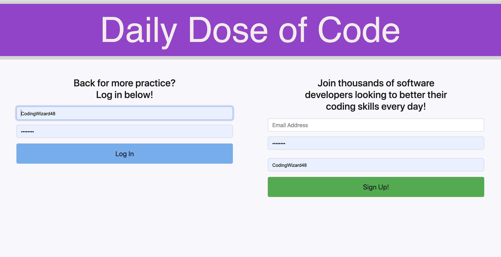

# Daily Dose of Code

  ## Description
  Daily Dose of Code is designed to give software developers an opportunity to practice and develop their coding skills. The site delivers a daily coding challenge to the user. The site also stores the past challenges in the following organizational structure: "not yet started", "in progress", and "complete". In addition, the site also offers a calendar which is used to keep track of past challenges. Daily Dose of Code also offers an embedded online code editor for the user to attempt and complete the challenges. This site is designed to store user data in a database, allowing for future login for new users.

  
   
  

  ## Table of Contents
  - [Usage](#usage)
  - [Contributing](#contributing)
  - [Questions](#questions)
  

  ## Usage

  Sign up for a free account, or sign in with an old account. This site is free of charge.

  ## Contributing

  This project is not accepting contriputions at this time.

  ## Questions

  If you have any questions, contact us at tjwetmore34@gmail.com, kbjss071@gmail.com, soulbrother47@gmail.com, or taylor.marymargaret@gmail.com. Visit the [GitHub repository link](https://github.com/TWetmore34/daily-dose-of-code) if you'd like!

 